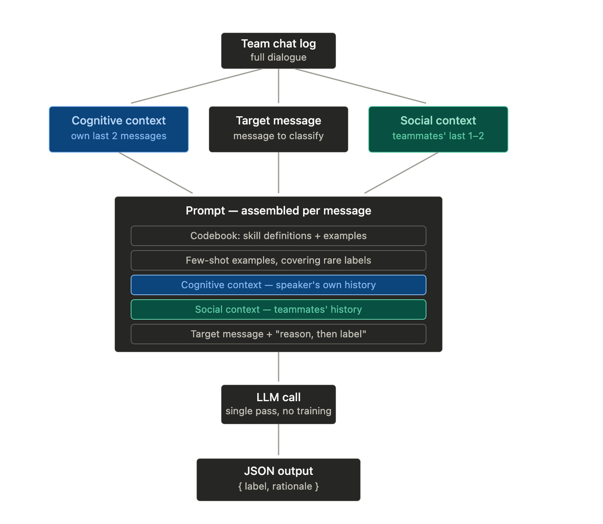

# contextual-llm-coding

Context-aware LLM coding of Collaborative Problem Solving (CPS) chat messages.

For each message in a team chat log, the classifier assembles a single prompt containing the codebook, few-shot examples, a **cognitive context** (the speaker's own recent messages), and a **social context** (teammates' recent messages), then makes one LLM call that returns a JSON label and rationale. No training or fine-tuning — one pass per message. The design follows CAP4CPS (Zhu et al., 2026); the codes come from the Andrews-Todd & Kerr (2019) CPS ontology.



## Codebook

Eight subskills across two dimensions, defined in `codebook_andrews_todd.json`:

| Dimension | Code | Subskill |
|-----------|------|----------|
| Cognitive | CRF  | Representing and formulating |
| Cognitive | CP   | Planning |
| Cognitive | CMC  | Monitoring communication |
| Cognitive | CEC  | Executing communication |
| Social    | SESU | Establishing shared understanding |
| Social    | SMC  | Maintaining communication |
| Social    | SN   | Negotiating |
| Social    | SSI  | Sharing information |

Definitions are paraphrased from Andrews-Todd & Kerr (2019) with examples from Zhu et al. (2026); refine against the original ontology before formal use.

## Setup

```bash
python3 -m venv .venv
source .venv/bin/activate
pip install -r requirements.txt
```

Put API keys in a `.env` file at the repo root:

```
ANTHROPIC_API_KEY=...
OPENAI_API_KEY=...
```

`demo.py` loads `.env` automatically via python-dotenv. For the `cps_classifier.py` CLI, export the variables into your shell first (e.g. `set -a; source .env; set +a`).

## Quick start

```bash
python demo.py            # offline mock client — no API key needed
python demo.py openai     # real run against OpenAI (gpt-4o)
python demo.py anthropic  # real run against Anthropic (claude-sonnet-4-6)
```

The demo prints one fully assembled prompt so you can inspect the design, then classifies an 8-message electronics-lab dialogue.

## CLI

Code a CSV of chat messages (columns: `speaker,text`):

```bash
python cps_classifier.py input.csv output.csv --provider anthropic
```

The output CSV adds `label`, `dimension`, `rationale`, and `votes` per message.

| Flag | Default | Meaning |
|------|---------|---------|
| `--provider` | `anthropic` | `anthropic`, `openai`, or `mock` |
| `--model` | provider default | override the model id |
| `--w-cognitive` | `2` | speaker's own prior messages in the context window |
| `--w-social` | `1` | teammates' prior messages in the context window |
| `--n-samples` | `1` | >1 enables self-consistency majority voting |
| `--verbose` | off | print each classification to stderr as it runs |

## Library

```python
from cps_classifier import CPSClassifier, Message, load_codebook, make_client

clf = CPSClassifier(
    make_client("anthropic"),
    load_codebook("codebook_andrews_todd.json"),
)
results = clf.classify_dialogue([
    Message("Lion", "What's everyone's voltage right now?"),
    Message("Tiger", "I currently have 2.0 volts with a 180 ohm resistor."),
])
```

Each `Result` carries the winning `label`, its `dimension`, the model's one-sentence `rationale`, the raw response, and the vote counts when self-consistency sampling is on.

## Notes

- Responses are validated against the codebook (label must be a known code) and retried with backoff on parse or validation failures.
- The default context windows — 2 cognitive, 1 social — were the best-performing in Zhu et al. (2026); both are configurable.
- The `mock` provider is a trivial keyword heuristic for testing the pipeline offline; don't use its labels for analysis.
